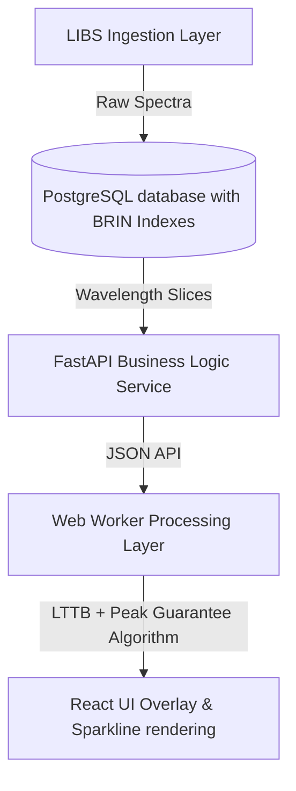

# Algorithmic & Software Abstraction Layers

This document describes the architectural abstraction layers implemented in `LunarAtlas` to decouple the database storage, processing algorithms, and front-end rendering engines. This modular separation of concerns ensures that the platform remains easily extensible to other spectroscopy formats (e.g., Raman, XRD) and other planetary missions.

---

## 1. High-Level Architecture Abstraction

---

## 2. Abstraction Components

### 2.1 Storage & Index Abstraction
* **Interface:** `apiService.tsx` & Python Ingestion Scripts.
* **Purpose:** Decouples physical database tables from spectral queries.
* **Mechanism:** Relies on **Block Range Indexing (BRIN)** and composite B-Tree indexes on `(measurement_id, wavelength_nm)`. This ensures that even queries traversing over $100$ million rows return physical disk page block offsets in under $10$ ms.

### 2.2 Processing & Downsampling Abstraction
* **Interface:** `useDownsampling` Custom React Hook.
* **Purpose:** Abstracts downsampling arithmetic away from component rendering cycles, offloading complex math to an asynchronous **Web Worker** thread to prevent main-thread UI stuttering.
* **Algorithm Implementation:** Decoupled into `lttbWorker.ts`. It takes input parameters:
  - `data: SpectralDataPoint[]`
  - `proportion: number`
  - `targetWavelengths?: number[]` (Anchor preservation points)
  And returns downsampled points and runtime execution metrics.

### 2.3 Visualization & Rendering Abstraction
* **Interface:** `MultiSpectralGraph.tsx` & `MiniSpectralCard.tsx`.
* **Purpose:** Abstracts raw charting SVG calculations into clean visual components.
* **Mechanism:** Computes reactive SVG coordinates from normalized ranges, enabling full fluid drag-to-pan, pinch-to-zoom, and hover isolations without external heavy canvas libraries.
