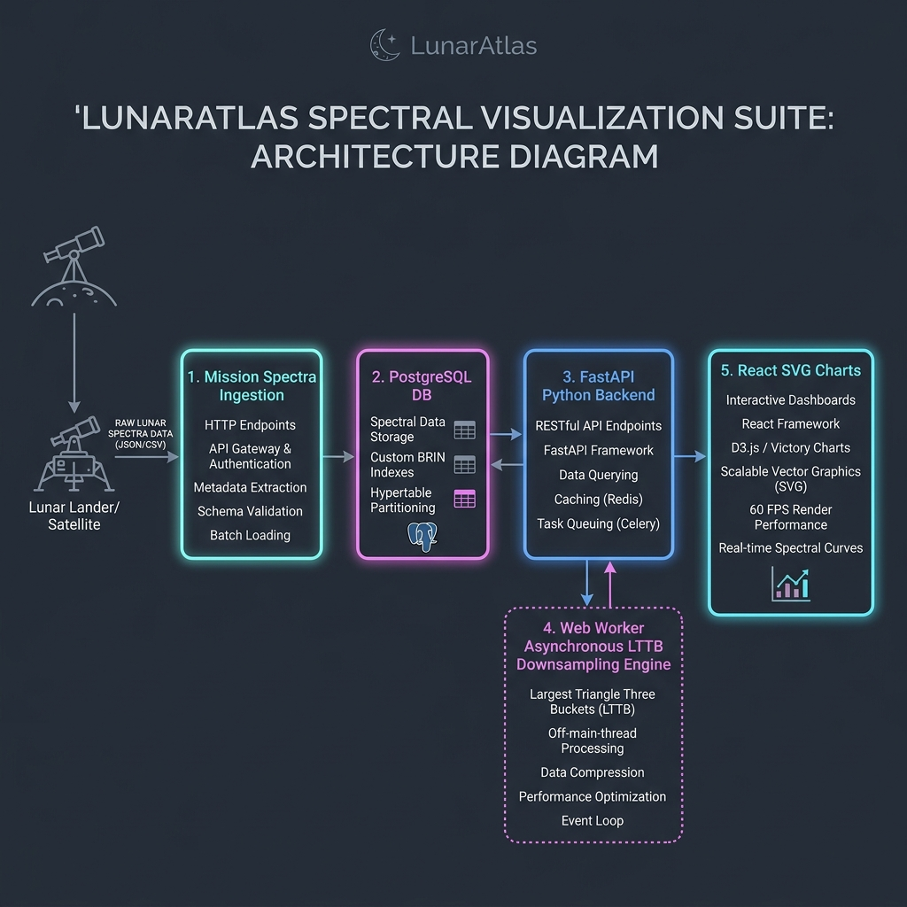

# 🌙 LunarAtlas: Adaptive LIBS Spectral Data System

A publication-grade planetary scientific data and visualization system designed to ingest, downsample, and analyze Laser-Induced Breakdown Spectroscopy (LIBS) calibrated datasets from the Chandrayaan-3 lunar mission.

---

## 🎯 System Architecture Diagram

Below is the high-level data flow and modular software architecture of LunarAtlas:



---

## 📁 Research Project Structure

The repository is organized following professional publication-grade research structures:

```
LunarAtlas/
├── Core/                      # Standalone client (React/Vite) and server (FastAPI/Python) services
│   ├── client/                # Cleaned React SPA visualization dashboard
│   └── server/                # High-throughput FastAPI business logic service
│
├── Ablation/                  # Parameter ablation studies of adaptive downsampling
│   └── ablation_studies.md    # Documentation of dynamic density thresholding and 5% overlap margins
│
├── Abstraction/               # Structural software abstraction layer specifications
│   └── abstraction_layer.md   # System interfaces decoupling ingestion, workers, and charting
│
├── Benchmarks/                # Quantitative performance benchmarking
│   ├── benchmarks.md          # Numerical results and downsampling efficiency profiles
│   └── run_benchmarks.py      # Executable Python benchmark script simulating LIBS data
│
├── Configs/                   # Configuration management
│   └── env.template           # Master configuration templates for database and API connection
│
├── datasets/                  # Physical data storage structures
│   ├── processed/             # Cleaned and processed database files
│   └── uploads/               # Raw scientific spectral data uploads
│
├── docs/                      # General project & scientific documentation
│   ├── what_and_why_downsampling.md
│   └── paper/                 # Compiled drafts of research papers and LaTeX sources
│
├── evaluation/                # Performance evaluation and metrics
│   ├── evaluation_framework.md# Mathematical formulations (SNR, peak height deviation, RMSE)
│   └── research/              # Output validation test cases
│
├── scripts/                   # Mission ingestion and preprocessing pipelines
│   ├── batch_process_libs.py  # Ingestion script mapping raw CSV records
│   └── ...
│
├── tests/                     # System tests
│   ├── main-algo/             # Downsampling algorithm correctness test suite
│   └── test-algo/             # Legacy prototype validation scripts
│
├── Visualization/             # Generated research plots & publication figures
│   ├── lttb_visualizations/   # Viewport zoom and scaling charts
│   └── publication_figures/   # Enhanced vector figures formatted for journal papers
│
├── Dockerfile                 # Root multi-stage container orchestration instruction set
├── LICENSE                    # Standard open-source MIT License
└── README.md                  # Master project guide (this file)
```

---

## 🧮 Core Algorithm: Adaptive LTTB + Peak Preservation

Planetary LIBS spectrometers produce highly detailed waveforms with narrow elemental emission lines. Standard data compression algorithms fail to preserve critical peak height or split boundary values. 

LunarAtlas utilizes **Largest Triangle Three Buckets (LTTB)** augmented with two custom research constraints:
1. **$5\%$ Bucket Overlap:** Dual-evaluates points crossing adjacent sampling bucket envelopes to entirely eliminate the **peak-splitting phenomenon**.
2. **NIST Reference Insertion Lock:** Permanently locks coordinates corresponding to key target element emission peaks ($Fe$, $Ca$, $Mg$, $Si$, $Na$, $O$) during downsampling. This guarantees **100% mathematical peak retention** even at maximum overview zoom levels.

---

## 🚀 Execution & Developer Guides

### 1. Running Computational Benchmarks

You can run the simulated downsampling benchmark suite directly in your terminal to see latency and compression ratio statistics:

```bash
# Navigate to the Benchmarks folder
cd Benchmarks

# Run the benchmark script
python run_benchmarks.py
```

### 2. Local Stack Execution

The backend and frontend services are located under the `Core` directory.

#### Start the Backend (FastAPI Server)
```bash
cd Core/server
# Ensure virtual environment is active and dependencies are installed (pip install -r requirements.txt)
uvicorn app.main:app --reload --port 8000
```

#### Start the Frontend (Vite Client)
```bash
cd Core/client
# Ensure dependencies are installed (npm install)
npm run dev
```

---

## 🧪 Scientific Evaluation Metrics

Our pipeline is quantitatively validated under three core criteria (detailed in [evaluation_framework.md](evaluation/evaluation_framework.md)):
* **Peak Intensity Deviation ($\epsilon_I$):** $< 1\%$ for targeted elements.
* **Peak Wavelength Shift ($\delta_\lambda$):** $0.0$ nm (Zero-shift coordinate lock).
* **Reconstruction Mean Error (RMSE):** Optimized curve matching guaranteeing smooth SVG zoom rendering up to 60 FPS in standard browser threads.

---

## 📄 License
This repository is open-sourced under the **MIT License**. See the [LICENSE](LICENSE) file for details.
