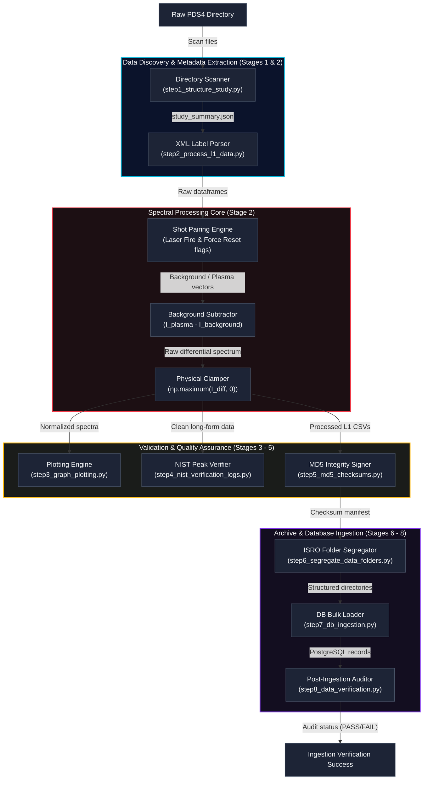
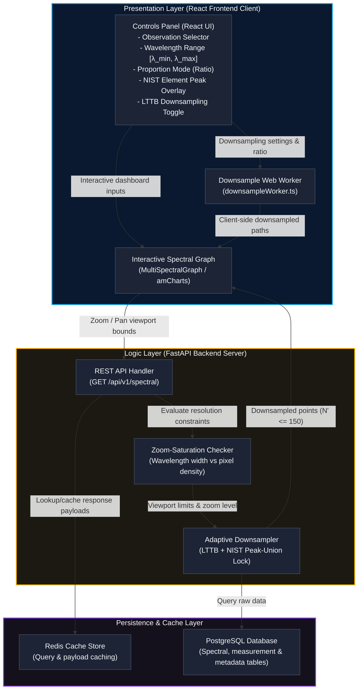

# LunarAtlas

**A Reproducible LIBS Spectral Data Processing and Visualization Infrastructure for Chandrayaan-3**

[](LICENSE)
[](https://www.python.org/)
[](https://github.com/LovekeshAnand/LunarAtlas/actions)
[](https://doi.org/10.5281/zenodo.[YOUR-ZENODO-ID])
[](docs/paper/paper.md)

---

## What Is LunarAtlas?

LunarAtlas is an open-source, end-to-end software infrastructure for the
ingestion, processing, and interactive visualization of Laser-Induced
Breakdown Spectroscopy (LIBS) Level-1 calibrated data from the ISRO
Chandrayaan-3 lunar mission.

It solves a real problem: the raw Chandrayaan-3 LIBS data is published in
PDS4 format by ISRO, but no open tool existed to process it into
analysis-ready spectral records. LunarAtlas provides that tool.

**Key results:**
- `max(0, I_plasma - I_background)` clamping reduces unphysical negative
  channel fraction from 49.6% to 0%
- NIST Peak-Union Lock raises elemental line retention from 6.25% to 100%
  at 10x data reduction
- Full pipeline from raw PDS4 to PostgreSQL-queryable spectra in one command

---

## Quick Start (3 Commands)

```bash
# 1. Clone and install
git clone https://github.com/LovekeshAnand/LunarAtlas.git
cd LunarAtlas
pip install -r requirements.txt

# 2. Run the full ingestion pipeline
#    (set RAW_DIR to your ISRO PRADAN download path)
python Pipeline/step2_process_l1_data.py "D:\ch3_libs\lib-v2\data\calibrated"

# 3. Start the API server and dashboard
cd core/server && uvicorn app.main:app --reload --port 8000
cd core/client && npm install && npm run dev
```

Or use Docker:
```bash
docker build -t lunaratlas .
docker run -p 8000:8000 lunaratlas
```

---

## Repository Structure

```
LunarAtlas/
│
├── Pipeline/                      # 8-stage ingestion pipeline
│   ├── step1_structure_study.py   # PDS4 directory scanner
│   ├── step2_process_l1_data.py   # Core: BG subtraction + clamping (Core contribution)
│   ├── step3_graph_plotting.py    # NIST overlay plots (300 DPI)
│   ├── step4_nist_verification_logs.py  # Peak detection + NIST cross-ref
│   ├── step5_md5_checksums.py     # Digital signature manifest
│   ├── step6_segregate_data_folders.py  # ISRO hierarchy replication
│   ├── step7_db_ingestion.py      # Batch PostgreSQL ingestion
│   ├── step8_data_verification.py # End-to-end MD5 audit
│   └── study_summary.json         # PDS4 inventory (auto-generated)
│
├── core/
│   ├── server/                    # FastAPI REST API
│   │   └── app/core/downsampling.py  # LTTB + NIST Peak-Union Lock (Novel algorithm)
│   └── client/                    # React/TypeScript dashboard
│       └── src/workers/downsampleWorker.ts  # Web Worker LTTB
│
├── tests/
│   ├── test_lttb_algorithm.py     # LTTB unit tests (pytest)
│   └── test_pipeline_processing.py  # Pipeline math unit tests (pytest)
│
├── docs/paper/
│   ├── paper.md                   # SoftwareX submission manuscript
│   └── paper.bib                  # Bibliography
│
├── experiment/                    # Ablation and validation scripts
│   ├── run_full_ablation.py       # Full validation experiment suite
│   └── LunarAtlas_Ablation_Study_Guide.pdf
│
├── Benchmarks/                    # Performance benchmarking
│   └── run_benchmarks.py
│
├── CITATION.cff                   # Machine-readable citation metadata
├── DATA_AVAILABILITY.md           # Data availability statement
├── CHANGELOG.md                   # Version history
├── CONTRIBUTING.md                # Contributor guide
├── requirements.txt               # Python dependencies
├── environment.yml                # Conda environment
└── Dockerfile                     # Container build
```

---

## Ingestion Pipeline Architecture



---

## Software Architecture & Control Flow



---

## Running the Tests

```bash
# From the repository root — no database needed
pip install pytest
pytest tests/ -v
```

Expected output:
```
tests/test_pipeline_processing.py::TestBackgroundSubtraction::test_positive_channels_preserved PASSED
tests/test_pipeline_processing.py::TestBackgroundSubtraction::test_negative_channels_clamped_to_zero PASSED
tests/test_pipeline_processing.py::TestAblationConfigs::test_p2_no_clamp_has_negatives PASSED
tests/test_lttb_algorithm.py::TestNISTPeakLock::test_all_target_wavelengths_present PASSED
...
```

---

## Running the Benchmarks

```bash
cd Benchmarks
python run_benchmarks.py
```

Benchmarks a 16,384-point mock LIBS spectrum at 4 reduction levels,
reporting latency and peak preservation accuracy.

---

## Data Availability

Raw data: [ISRO PRADAN Portal](https://pradan.issdc.gov.in/) (free registration)
Processed data + code: [Zenodo DOI: 10.5281/zenodo.[YOUR-ZENODO-ID]](https://doi.org/10.5281/zenodo.[YOUR-ZENODO-ID])

See [`DATA_AVAILABILITY.md`](DATA_AVAILABILITY.md) for the full statement.

---

## Citing LunarAtlas

If you use LunarAtlas in your research, please cite:

```bibtex
@software{lunaratlas2025,
  author    = {Anand, Lovekesh},
  title     = {{LunarAtlas: A Reproducible LIBS Spectral Data Processing
               and Visualization Infrastructure for Chandrayaan-3}},
  year      = {2025},
  publisher = {Zenodo},
  doi       = {10.5281/zenodo.[YOUR-ZENODO-ID]},
  url       = {https://github.com/LovekeshAnand/LunarAtlas}
}
```

GitHub also shows a "Cite this repository" button (powered by [`CITATION.cff`](CITATION.cff)).

---

## License

This project is licensed under the **MIT License** — see [`LICENSE`](LICENSE) for details.

---

## Contributing

See [`CONTRIBUTING.md`](CONTRIBUTING.md) for how to report bugs, suggest features,
and submit pull requests.
